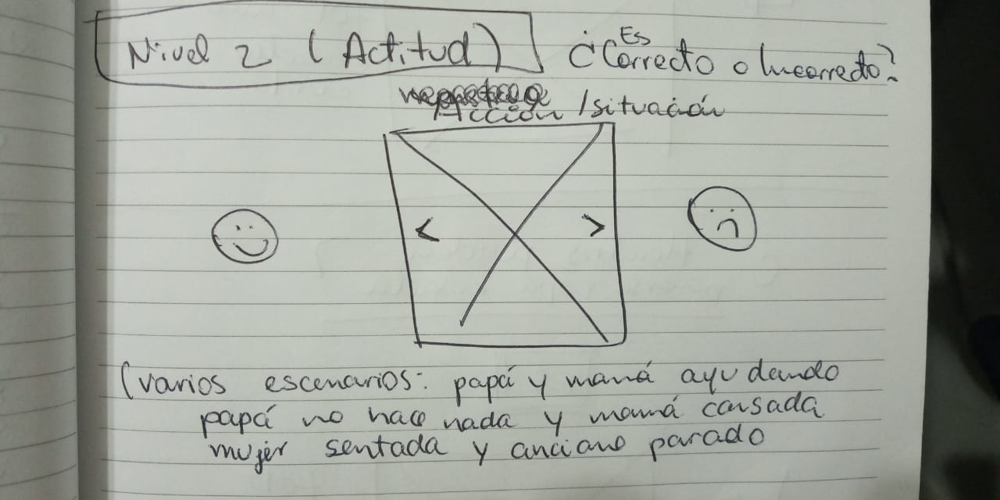
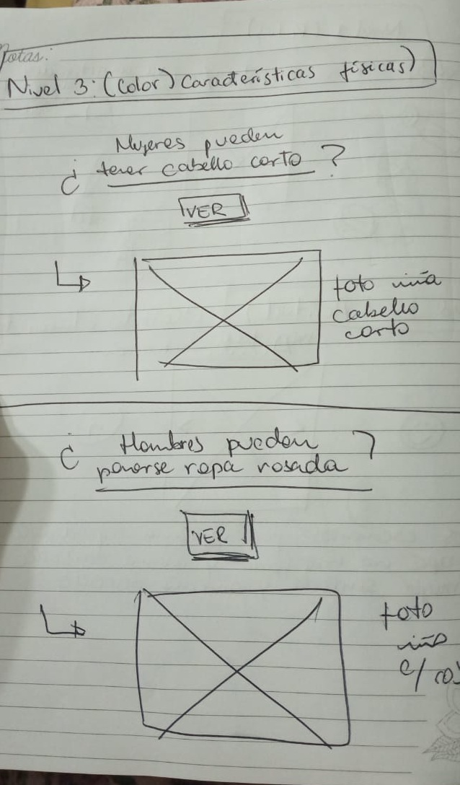
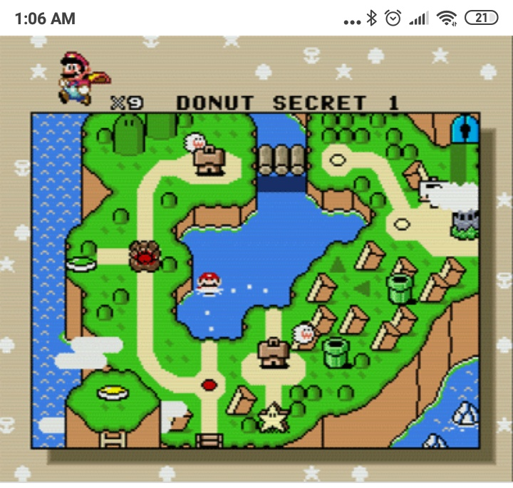
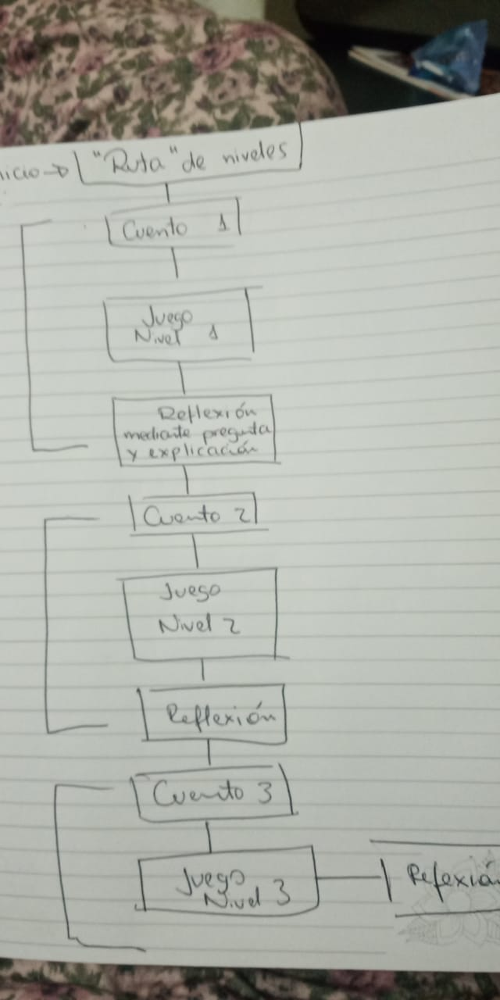

# Hackatrix

Hosting que usaremos:

:
 firebase  por su compatibilidad con angular

Framework de js? 
: 
Angular

Necesitaremos back? 
: 
para el MVP , creo que no, puede ser un archivo json, un objeto js.
 

Qué informacion se guardaría ahí? 

:  
los niveles, las historias, url o rutas locales de imágenes

Framework de css?

:
Bootstrap, para facilitar el desarrollo

Roles que se te ocurren :

-Realizar  slide  para el nivel 2 .
- Modelar el json de historias, preguntas ,e imágenes
- averiguar como, se puede hacer un mapa de progreso parecido a la 4ta imagen, con css , una imagen e iconos o etc 
- 

Mockups que tenemos hasta ahora:

This project was generated with [Angular CLI](https://github.com/angular/angular-cli) version 8.0.1.

## Development server

Run `ng serve` for a dev server. Navigate to `http://localhost:4200/`. The app will automatically reload if you change any of the source files.

## Code scaffolding

Run `ng generate component component-name` to generate a new component. You can also use `ng generate directive|pipe|service|class|guard|interface|enum|module`.

## Build

Run `ng build` to build the project. The build artifacts will be stored in the `dist/` directory. Use the `--prod` flag for a production build.

## Running unit tests

Run `ng test` to execute the unit tests via [Karma](https://karma-runner.github.io).

## Running end-to-end tests

Run `ng e2e` to execute the end-to-end tests via [Protractor](http://www.protractortest.org/).

## Further help

To get more help on the Angular CLI use `ng help` or go check out the [Angular CLI README](https://github.com/angular/angular-cli/blob/master/README.md).
